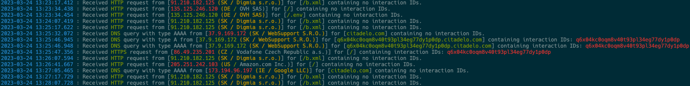

# CO2 - Collaborator Colorizer

**CO2** - Collaborator Colorizer is a simple tool to enhance Burpsuite collaborator logs. Reads input from stdin, processes it and prints it out. 




## Features

* Amends the source IP address with the name of its resource holder (IP block owner) obtained from RIPE DB.
* Color highlighting to look more 1337 and to replace [ccze](https://github.com/cornet/ccze).
* Runtime cache to minimize API calls and to identify new IPs in log (first occurence)
* Persistent IP cache stored in json, also usable as custom IP annotations

### Planed features

* Parse input from locale file
* Log minification for interaction polling on android phones (`termux`)

## Usage

```
Usage of ./co2:
  -c string
    	JSON cache file to use. (default "cache.json")
  -i	Display lines containing interacions only.
```

BEFORE: Example pipeline with public collaborator and `ccze`

```bash
curl -sA "${USER}-curl" "http://polling.burpcollaborator.net/burpresults?biid=${BIID}" | \
tail -n 32 | grep 'IDs:' | ccze -m ansi
```

NOW: Example pipeline with private collaborator and `co2`

```bash
curl -sA "${USER}-curl" -u login:pass "https://yourcollab.pwn:1337/burp.txt?${RANDOM}" | \
tail -n 32 | co2 -i
```


Note : *Yes, this is just a golang playground project to play with different tooling*